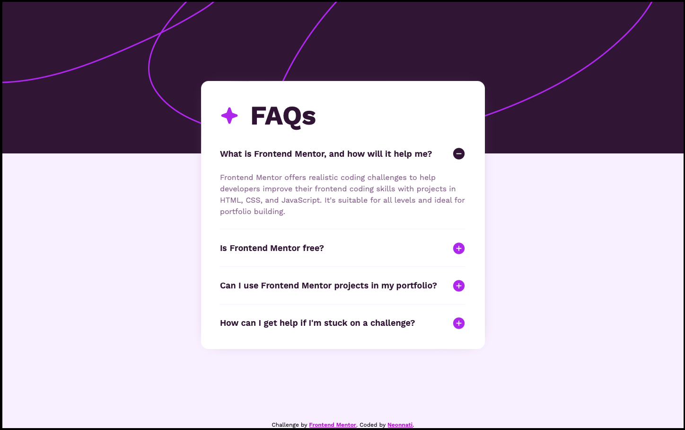

# Frontend Mentor - FAQ accordion solution

This is a solution to the [FAQ accordion challenge on Frontend Mentor](https://www.frontendmentor.io/challenges/faq-accordion-wyfFdeBwBz). Frontend Mentor challenges help you improve your coding skills by building realistic projects. 

## Table of contents

- [Overview](#overview)
  - [The challenge](#the-challenge)
  - [Screenshot](#screenshot)
  - [Links](#links)
- [My process](#my-process)
  - [Built with](#built-with)
  - [What I learned](#what-i-learned)

## Overview

### The challenge

Users should be able to:

- Hide/Show the answer to a question when the question is clicked
- Navigate the questions and hide/show answers using keyboard navigation alone
- View the optimal layout for the interface depending on their device's screen size
- See hover and focus states for all interactive elements on the page

### Screenshot

### Links

- Solution URL: [Add solution URL here](https://github.com/Neonnati/FAQ_accordion_solution)
- Live Site URL: [Add live site URL here](https://neonnati.github.io/FAQ_accordion_solution/)

## My process

### Built with

- Semantic HTML5 markup
- CSS custom properties
- Vanilla javaScript

### What I learned

I leaned a lot with this project. I wanted to make the answers fade-in and out and I wasn't sure how to do that.
I used chatGPT to learn that, and had a lot of follow-up questions. It's important to me to not just -
get the solutions from chatGPT, but to really anderstand how things works.
One of the greatest thing about chatGPT is that you can ask about every little code line, why and how and why not something else. frontend mentor is as close as I can get to have a real job experience, but its a lonely one. chatGPT is having a coworker that is much more advenced than you and willing to help.
I leatn a lot about the differences between getElementByClassName and querySelectorAll,
the nextElementSibling (which I haven't use eventually), scrollHeight and more.

I really fill that this chalange gave me alot.